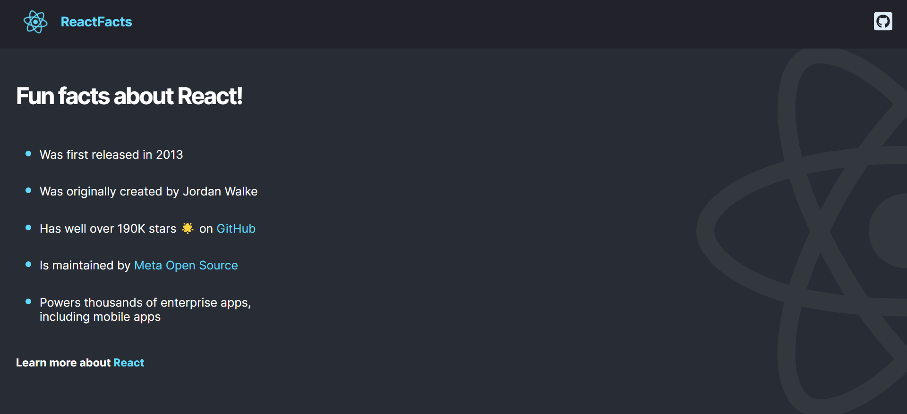

# My first React App
Practice project following the course from freeCodeCamp.

The site is live [here](https://react-facts-asmit2952.vercel.app/).

## Getting Started with Create React App

This project was bootstrapped with [Create React App](https://github.com/facebook/create-react-app).

### `npm start`

Runs the app in the development mode.
Open [http://localhost:3000](http://localhost:3000) to view it in your browser.

The page will reload when you make changes.